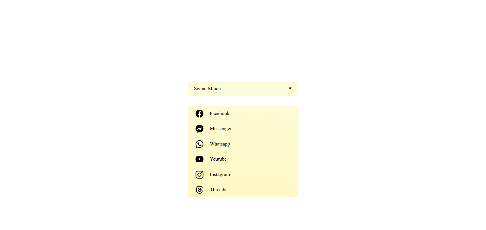

## Responsive Select Menu: A Custom Design Using HTML, CSS, and JavaScript
<a href="https://www.linkedin.com/in/dharmendraverma95/" target="_blank">LinkedIn Profile </a>

<a href="https://www.behance.net/dhirukumar" target="_blank">Behance Profile </a>

## Project Overview
This project demonstrates how to create a responsive and interactive custom select menu using HTML, CSS, and JavaScript. It aims to replace the default browser select box with a more stylish and customizable design. The menu is fully responsive, making it suitable for both desktop and mobile web applications.

## Features
- Custom select box design with smooth animations.
- Responsive layout that works across different screen sizes.
- Easy to integrate into any HTML form or web application.
- Interactive with dropdown options using JavaScript.
- Clean and simple design using only HTML and CSS.
  

###### Lang
<ul>
  <li>HTML5</li>
  <li>CSS3</li>
  <li>Bootstrap Icon</li>
  <li>ChatGPT [For Content]</li>
  <li>ui / ui layout Design</li>
  <li>desgin in Abode XD</li>
</ul>

 
Desktop Design 

 
Desktop UI UX Design 

 
Desktop Design ui-ux Layout 

 
Desktop Design 

Cover 
